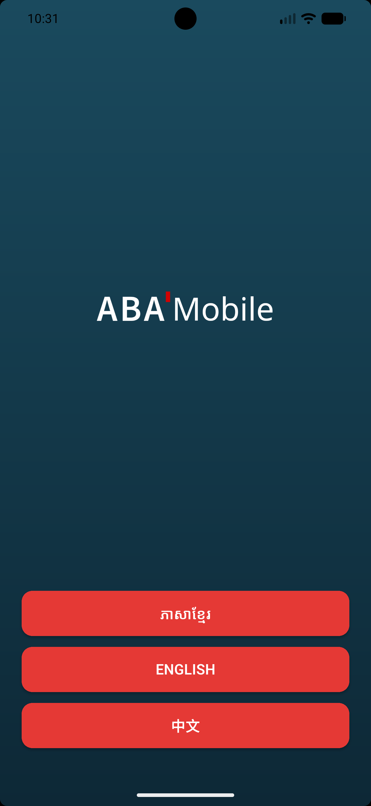
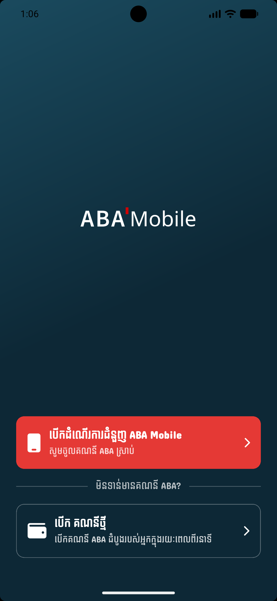
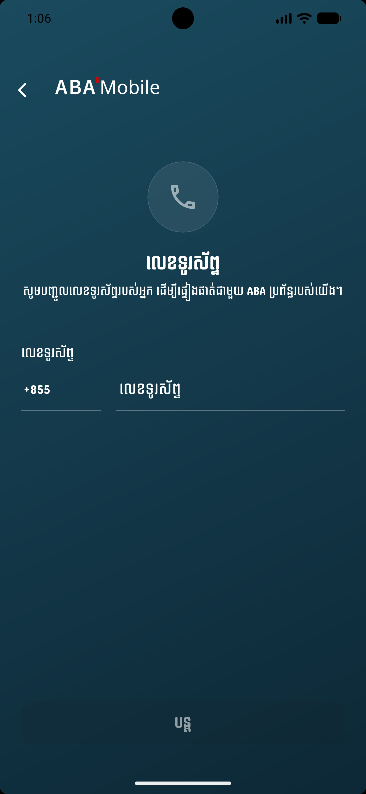
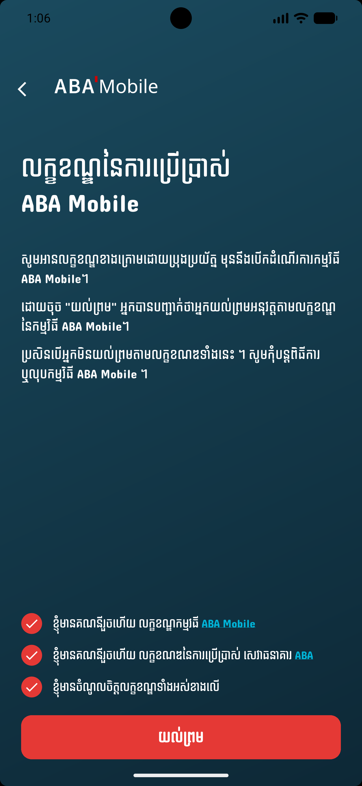
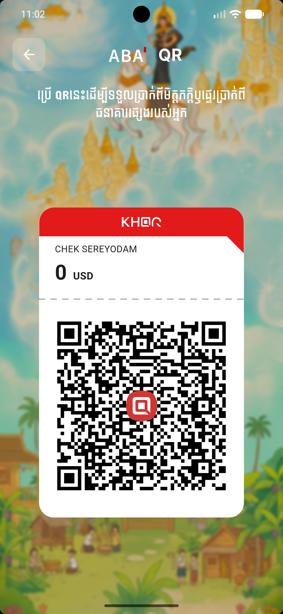

# 💳 ABA Bank Clone - Flutter Banking App

<div align="center">


**A premium banking application clone with smooth animations and modern UI/UX design**

</div>
<div align="center">
  <table>
    <tr>
      <td align="center"><b>Login 1</b><br></td>
      <td align="center"><b>Login 2</b><br></td>
       <td align="center"><b>Phone</b><br></td>
       <td align="center"><b>Verify</b><br></td>
      <td align="center"><b>Home 1</b><br></td>
      <td align="center"><b>Home 2</b><br></td>
      <td align="center"><b>QR Code</b><br></td>
    </tr>
  </table>
</div>

## ⚠️ Disclaimer

> 🎓 **Educational Purpose Only**
> 
> This project is developed as a **student assignment** for educational and portfolio purposes only. It is **not affiliated with, endorsed by, or connected to ABA Bank** or any of its subsidiaries.
> 
> - 🔒 This app does **not** connect to any real banking systems or APIs
> - 💰 No real transactions, money transfers, or financial operations are performed
> - 🔐 All data used is **mock/dummy data** for demonstration purposes
> - 🚫 This app should **not** be used for actual banking activities
> 
> *All trademarks, logos, and brand names are the property of their respective owners. This project is for learning Flutter development and UI/UX design principles.*

---

## 📱 Overview

ABA Bank Clone is a fully functional banking application built with Flutter, featuring **premium smooth animations**, **high-quality UI components**, and a **seamless user experience**. This project replicates the core features of a modern banking app with stunning visuals and fluid interactions.

> 🎯 **Project Type**: Academic Assignment / Portfolio Project

## ✨ Features

- 🔐 **Secure Login & Authentication** (Mock)
- 🏠 **Beautiful Home Dashboard**
- 📱 **Phone Number Verification** (Simulation)
- 📊 **QR Code Payment Integration** (Demo)
- ✅ **Account Verification System**
- 🎨 **Premium UI/UX Design**
- 🌊 **Smooth Page Transitions & Animations**
- 📲 **Cross-Platform Support** (Android, iOS, Web, Windows, macOS, Linux)
- 🌙 **Modern Material Design**
- ⚡ **High Performance & Optimized**


## 🎨 Animation Highlights

- ✨ **Smooth Page Transitions** - Fluid navigation between screens
- 🌊 **Hero Animations** - Elegant shared element transitions
- 💫 **Micro-interactions** - Delightful button presses and feedback
- 🎭 **Custom Animations** - Unique loading states and effects
- 🔄 **Gesture-based Animations** - Swipe and pull-to-refresh
- ⚡ **60 FPS Performance** - Optimized for smooth rendering

## 🚀 Getting Started

### Prerequisites

- Flutter SDK (3.0 or higher)
- Dart SDK (2.17 or higher)
- Android Studio / VS Code
- Xcode (for iOS development)

### Installation

1. **Clone the repository**
   ```bash
   git clone https://github.com/SereyodamChek/aba_bank_clone.git
   cd aba_bank_clone
   ```

2. **Install dependencies**
   ```bash
   flutter pub get
   ```

3. **Run the app**
   ```bash
   flutter run
   ```

### Build for Production

```bash
# Android
flutter build apk --release

# iOS
flutter build ios --release

# Web
flutter build web --release

# Windows
flutter build windows --release

# macOS
flutter build macos --release

# Linux
flutter build linux --release
```

## 📁 Project Structure

```
aba_bank_clone/
├── lib/
│   ├── main.dart              # App entry point
│   ├── screens/               # App screens
│   │   ├── login/            # Login screens
│   │   ├── home/             # Home dashboard
│   │   ├── verification/     # Phone & account verification
│   │   └── payment/          # QR payment
│   ├── widgets/              # Reusable UI components
│   ├── animations/           # Custom animations
│   ├── utils/                # Helper functions
│   └── models/               # Data models
├── assets/
│   ├── images/               # App images & screenshots
│   └── fonts/                # Custom fonts
├── android/                  # Android platform files
├── ios/                      # iOS platform files
├── web/                      # Web platform files
├── windows/                  # Windows platform files
├── macos/                    # macOS platform files
├── linux/                    # Linux platform files
└── test/                     # Unit & widget tests
```

## 🛠️ Technologies & Packages

- **Flutter** - UI Framework
- **Dart** - Programming Language
- **Provider/Riverpod** - State Management
- **Animated Containers** - Smooth animations
- **Hero Widgets** - Page transitions
- **Custom Paint** - Advanced animations
- **Google Fonts** - Typography
- **Flutter SVG** - Vector graphics support

## 🎯 Key Features Implementation

### 🔐 Authentication
- Secure login with validation
- Phone number verification
- OTP integration ready (Mock)

### 💳 Banking Features
- Account balance display (Mock data)
- Transaction history (Demo)
- QR code payments (Simulation)
- Money transfer (UI only)

### 🎨 UI/UX
- Modern material design
- Responsive layouts
- Dark/Light theme support
- Accessibility features

## 📱 Supported Platforms

| Platform | Status |
|----------|--------|
| Android  | ✅ Supported |
| iOS      | ✅ Supported |
| Web      | ✅ Supported |
| Windows  | ✅ Supported |
| macOS    | ✅ Supported |
| Linux    | ✅ Supported |

## 🤝 Contributing

Contributions are welcome! Please feel free to submit a Pull Request.

1. Fork the project
2. Create your feature branch (`git checkout -b feature/AmazingFeature`)
3. Commit your changes (`git commit -m 'Add some AmazingFeature'`)
4. Push to the branch (`git push origin feature/AmazingFeature`)
5. Open a Pull Request

## 📄 License

This project is licensed under the MIT License - see the [LICENSE](LICENSE) file for details.

## 👨‍💻 Author

**Sereyodam Chek**
- GitHub: [@SereyodamChek](https://github.com/SereyodamChek)
- Repository: [aba_bank_clone](https://github.com/SereyodamChek/aba_bank_clone)

## 🙏 Acknowledgments

- Flutter team for the amazing framework
- Design inspiration from ABA Bank (for educational purposes)
- Community contributors and open-source packages
- Instructors and mentors for guidance

## 📞 Support

If you have any questions or need help, please open an issue or contact me directly via GitHub.

---

<div align="center">

**Made with ❤️ using Flutter** | 🎓 Student Assignment Project

⭐ Star this repo if you find it helpful!

</div>
